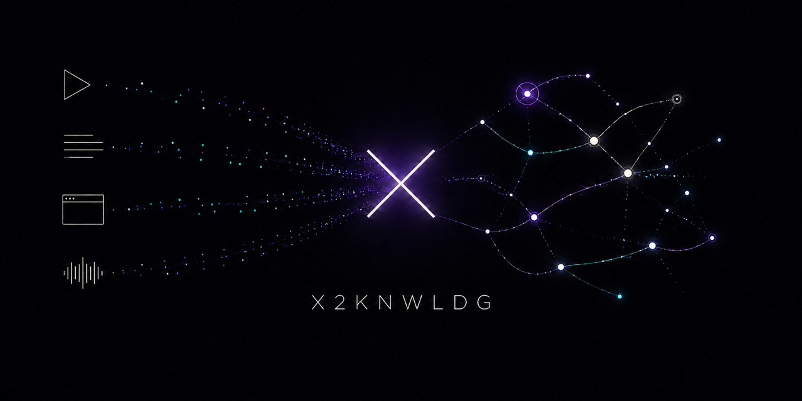

# X2KNWLDG



X2KNWLDG turns source material into a local, traceable knowledge base. It preserves
the evidence, extracts source-grounded knowledge before synthesis, validates
provenance and coverage, and produces a searchable graph plus Obsidian-ready notes.

The current release supports timestamped YouTube content and public X/Twitter posts
or same-author self-threads. The pipeline is designed to accept more source adapters,
but Medium, arbitrary web pages, books, PDFs, and EPUBs are **not implemented yet**.

Narrative knowledge is produced in Persian by project policy: knowledge-unit content,
normalization, summaries, analysis, derivation notes, and human-readable coverage notes.
Technical terms include their English equivalent when useful. Evidence excerpts always
remain verbatim in the source language, while source titles and acquisition metadata stay
in their original form. Machine-readable keys and controlled values are not translated.

> **Project status:** active development (`0.1.0`). Canonical formats and the read-only
> API are tested, but backward compatibility is not yet promised across minor releases.

## Why X2KNWLDG?

Most “content to notes” tools start by compressing a source into a summary. That can
silently remove the very detail needed to verify or reuse an idea. X2KNWLDG instead:

1. preserves immutable raw evidence;
2. extracts small, typed knowledge units with exact provenance;
3. separates source claims from model-derived synthesis;
4. audits coverage and reports `PASS`, `PARTIAL`, or `FAIL` honestly;
5. builds Markdown notes, a graph, and a local browsing interface.

No cloud database is required. The core Python package has no runtime dependencies,
and the optional web interface binds to loopback only.

## Supported sources

| Source | Current support | Provenance unit | Acquisition |
|---|---|---|---|
| YouTube | **Supported** | Timestamped caption range | Native captions, or a user-provided timestamped transcript |
| X/Twitter | **Supported with documented limits** | Exact character span in a public post | Credential-free, pinned local `x-cli` provider |
| Medium articles | **Planned** | — | No adapter or capture contract yet |
| Other web pages | **Planned** | — | No adapter or capture contract yet |
| Books / PDF / EPUB | **Planned** | — | No adapter or capture contract yet |

“Planned” means the source-neutral index, graph, UI, and finalization seams are ready
to be extended. It does not mean that a URL or file of that type can be ingested today.
See [WORKFLOW.md](WORKFLOW.md) for the exact, currently executable paths.

## What you get

- canonical source metadata and preserved evidence;
- source-grounded and derived knowledge units in separate classes;
- typed relationships and a cumulative cross-source knowledge graph;
- an explicit coverage audit and machine-readable validation report;
- a Markdown report with clickable source citations;
- an Obsidian-compatible vault subtree with frontmatter and wikilinks;
- local search, Library, Reader, and interactive Knowledge Map views;
- the same portable files whether the model passes are run through Codex or Claude.

## Interface preview

The local Knowledge Canvas contains three implemented views: Library, Reader, and
Knowledge Map. Final screenshots are intentionally not committed yet. The comments
below mark their exact future positions; the capture specification and filenames are
in [`assets/readme/README.md`](assets/readme/README.md).

<!-- README SCREENSHOT SLOT 1
Replace this comment with:

Capture: desktop, English UI, at least one YouTube run and one X run, with PASS/PARTIAL
badges visible. Do not use private source titles or evidence.
-->

### Read without losing provenance

The Reader keeps the source, knowledge units, relationships, validation state, and
coverage result together. Missing evidence is shown as missing; it is never replaced
with an invented timestamp or excerpt.

<!-- README SCREENSHOT SLOT 2
Replace this comment with:

Capture: one fixture source, a source-grounded unit, its citation, and the coverage
panel. Prefer a state that demonstrates provenance rather than a decorative overview.
-->

### Explore connections

The Knowledge Map supports search, keyboard-accessible navigation, focused
neighbourhoods, relationship cues, and a DOM outline that remains usable without
WebGL or a pointer.

<!-- README SCREENSHOT SLOT 3
Replace this comment with:

Capture: a selected node, related knowledge, legend, and Quick Read panel at a useful
zoom. Avoid an empty or unlabelled graph.
-->

### Use the result in Obsidian

`finalize` writes plain Markdown notes under each run's `vault/` directory. Notes use
YAML frontmatter, stable filenames, and Obsidian wikilinks for source backlinks,
derived-from links, and relationships. You can open that directory as a vault or copy
its generated subtrees into an existing vault.

This is file-format compatibility, not an Obsidian plugin: X2KNWLDG does not install
Obsidian, manage community plugins, or sync your vault.

<!-- README SCREENSHOT SLOT 4
Replace this comment with:

Capture: a disposable fixture vault with source and derived notes visibly connected.
Do not capture a personal vault.
-->

## Quick start

Requirements:

- Python 3.10 or newer;
- Node.js `^20.19.0` or `>=22.12.0` only if you want the web UI;
- a supported source and, for X/Twitter, the separately installed pinned provider
  described in [the workflow](WORKFLOW.md#twitterx-posts-and-self-threads).

Create an environment and install the source-specific extras you need:

```bash
python -m venv .venv
.venv/bin/pip install -e '.[youtube]'
```

### YouTube

Use native captions when available:

```bash
.venv/bin/x2knwldg process "https://www.youtube.com/watch?v=VIDEO_ID"
```

If captions are unavailable, the command exits `5` (`TRANSCRIPT_REQUIRED`) and creates
`inbox/<video-id>/README.md`. Supply `SRT`, `VTT`, timestamped JSON, or timestamped
TXT/Markdown, then import it:

```bash
.venv/bin/x2knwldg import-transcript inbox/<video-id>/transcript.vtt \
  --video-id <video-id> \
  --video-url "https://www.youtube.com/watch?v=<video-id>"
```

Plain text is accepted only with explicit ranges:

```text
[00:00:00 - 00:00:07] First timestamped caption.
[00:00:07 - 00:00:15] Second timestamped caption.
```

Whisper and WhisperX are never installed or used as a fallback.

### X/Twitter

Capture one public post, or walk a same-author self-thread upward from its last post:

```bash
.venv/bin/x2knwldg capture "https://x.com/<user>/status/<id>" --via-tunnel
.venv/bin/x2knwldg capture "<last-post-id>" --thread --via-tunnel
```

For a thread, supply the **last post**, not the root. The credential-free provider
cannot enumerate descendants; a root-anchored thread is therefore `PARTIAL`, never a
silent success. No X account, cookie, token, or browser profile is used or read.

Provider installation, pin verification, network disclosure, capability limits, and
troubleshooting are documented in
[WORKFLOW.md § Twitter/X](WORKFLOW.md#twitterx-posts-and-self-threads).

### Extract, validate, and finalize

Acquisition creates canonical inputs; the model passes described in
[WORKFLOW.md](WORKFLOW.md) produce an `extraction_bundle.json`. The same final commands
work for both supported sources:

```bash
.venv/bin/x2knwldg apply-bundle output/<run-id> extraction_bundle.json
.venv/bin/x2knwldg validate output/<run-id>
.venv/bin/x2knwldg finalize output/<run-id>
```

Completion may be claimed only when the command exits `0`. A `PARTIAL` run is a real,
inspectable deliverable, but it is not a pass.

## Local Knowledge Canvas

Install and build the optional local UI:

```bash
.venv/bin/pip install -e '.[ui]'
(cd web && npm ci && npm run build)
.venv/bin/x2knwldg ui
```

The command refreshes the local index, serves the built frontend on a loopback address,
prints the actual URL, and opens it in your browser. Use `--no-open` to suppress the
browser, or `--root` to point at another project directory. Non-loopback bind addresses
are refused.

Frontend development details live in [`web/README.md`](web/README.md). The read-only
HTTP contract is versioned under [`schemas/api/v1/`](schemas/api/v1/README.md).

## Canonical files

A YouTube run contains timestamped transcript and segment files:

```text
output/<video-id>/
├── raw/                         # immutable evidence
├── metadata.json
├── transcript.json
├── segments.json
├── knowledge_units.json
├── relationships.json
├── coverage.json
├── validation.json
├── graph.json
├── report.md
└── vault/
```

An X/Twitter run replaces transcript segmentation with `capture.json`; a post is the
citation unit. Files under `raw/` remain immutable in both forms. Existing runs are not
silently overwritten.

The project-wide `output/library/` is rebuilt from finalized runs and holds the
cumulative concept registry and graph. Source-grounded data remains distinguishable
from derived knowledge throughout the canonical files, the index, and the UI.

## Exit codes

| Code | Name | Meaning |
|---:|---|---|
| `0` | `PASS` | The command succeeded; validated runs passed validation and coverage |
| `1` | `ERROR` | Invalid input, corrupt/missing files, an occupied run directory, or another refused operation |
| `2` | usage error | Invalid or incomplete command-line syntax |
| `3` | `PARTIAL` | Validation passed, but coverage or source completeness is honestly incomplete |
| `4` | `FAIL` | The run failed validation |
| `5` | `TRANSCRIPT_REQUIRED` | YouTube has no usable native captions; provide a timestamped transcript |
| `6` | `UI_NOT_BUILT` | The local server is ready but `web/dist` has not been built |
| `7` | `PROVIDER_UNAVAILABLE` | The X acquisition provider is missing or does not match its pin |
| `8` | `PROVIDER_UNREACHABLE` | The provider learned nothing because of timeout, rate limit, or network failure |
| `9` | `PROVIDER_DRIFT` | The provider answered in an unusable shape |

`x2knwldg --help` is the command-line source of truth for this table.

## Agent and desktop-client use

The workflow and canonical files are vendor-neutral. Codex can work directly in the
project. Claude Desktop can use the optional MCP server for the currently exposed
YouTube-oriented tools:

```bash
.venv/bin/pip install -e '.[mcp]'
```

Configure the client to launch:

```text
/absolute/path/to/X2KNWLDG/.venv/bin/x2knwldg-mcp
```

Set `X2KNWLDG_PROJECT_ROOT` to the checkout's absolute path. A configuration template
is available at
[`config/claude_desktop_config.example.json`](config/claude_desktop_config.example.json).
X/Twitter acquisition currently uses the CLI; the MCP tool surface has not yet been
generalized to every source type.

Agents must follow [WORKFLOW.md](WORKFLOW.md). The concise client-specific guardrails
are in [AGENTS.md](AGENTS.md) and [CLAUDE.md](CLAUDE.md).

## Development

Install all test dependencies and run the Python checks:

```bash
.venv/bin/pip install -e '.[dev,legacy,ui]'
.venv/bin/pytest -q
.venv/bin/ruff check .
.venv/bin/mypy
```

Run the frontend checks:

```bash
cd web
npm ci
npm run lint
npm run typecheck
npm test
npm run build
```

CI tests Python 3.10, 3.12, 3.13, and 3.14 on Linux, includes a macOS row, verifies the
zero-dependency core, installs every optional extra independently, and checks the
frontend and browser paths. See [`.github/workflows/ci.yml`](.github/workflows/ci.yml).

When contributing a new source type, add the acquisition/capture contract, extraction
rules, adapter, medium profile, fixtures, validators, vault rendering, documentation,
and coexistence tests together. A row in a roadmap or enum is not source support.

## Privacy and security boundaries

- Evidence and generated knowledge stay in the local project unless an acquisition
  command contacts the named source.
- The web UI and API are read-only and loopback-only.
- Raw evidence is immutable and digest-checked.
- YouTube acquisition contacts YouTube through its optional libraries.
- X/Twitter acquisition invokes a separately installed, digest-pinned local tool and
  contacts X; it does not use account credentials or third-party mirrors.
- Generated reports may contain links to external sources. The UI does not load an
  external YouTube embed until the user asks it to.

Do not ingest private, confidential, or copyrighted material unless you have the right
to store and process it.

## Limitations and roadmap

- Medium, general web-page, book, PDF, and EPUB ingestion are not implemented.
- X/Twitter support is limited to public posts and same-author self-threads walked from
  a user-asserted terminal post; reply trees and timelines are outside the current scope.
- X post text completeness cannot be independently corroborated on the implemented route.
- The model passes require an agent; the CLI does not perform autonomous language-model
  extraction.
- The local UI is a reader and explorer, not an editor or synchronization service.

The detailed implementation plan and decision history are in
[`docs/PROJECT_MANAGEMENT.md`](docs/PROJECT_MANAGEMENT.md) and
[`docs/KNOWLEDGE_CANVAS_PLAN.md`](docs/KNOWLEDGE_CANVAS_PLAN.md).

## Origin, license, and attribution

X2KNWLDG is an independent derivative of
[`velmighty/youtube-to-knowledge`](https://github.com/velmighty/youtube-to-knowledge).
It is not affiliated with or endorsed by the upstream author.

The project is distributed under the MIT License. The upstream and X2KNWLDG copyright
notices are preserved in [`LICENSE`](LICENSE); dependency and provenance details are in
[`THIRD_PARTY_NOTICES.md`](THIRD_PARTY_NOTICES.md).
